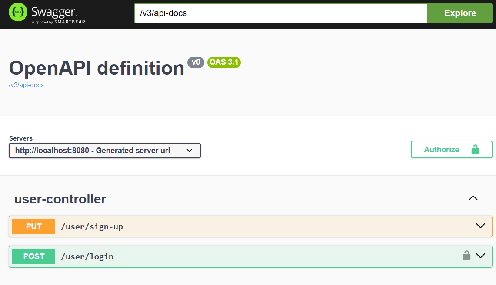

# SermalucBCI 

Proyecto solicitado como prueba en Sermaluc BCI.
> ### ✨ Nota de Implementación 
> Se agregaron los tres requisitos marcados como opcionales (JWT, pruebas unitarias, Swagger). Además, para ofrecer una solución técnica completa y funcional, se ha incluido un endpoint de autenticación (login) que no formaba parte del requerimiento inicial, esto permite validar el token y la creación de usuario.

## Requisitos Previos

- Java Amazon Corretto o Open JDK (versión 17)
- Maven (versión recomendada 3.6+)

## Configuración del Proyecto

1. Clona este repositorio

### Ejecución local

Para ejecutar el proyecto localmente, sigue estos pasos:

1. Abre una terminal en la raíz del proyecto.
2. Ejecuta el siguiente comando para compilar:

```
mvn compile
```   
3. Ejecuta el siguiente comando para ejecutar en ambiente local:

```
mvn spring-boot:run
```
## Pruebas

### Documentación con Swagger:
🔗 [http://localhost:8080/swagger-ui/index.html](http://localhost:8080/swagger-ui/index.html)

### Uso de Authorization en Swagger para login (candado):
1. Haz clic en el botón **Authorize** arriba a la derecha.
2. Pega el Token (ej: `eyJhbG...`). Swagger añadirá automáticamente el prefijo `Bearer`.
3. El endpoints login protegido enviará el header `Authorization` correctamente en cada petición.


### Ejecución de las pruebas de integración con el siguiente comando:
```
mvn test
```

## Consideraciones

1. La base de datos persiste en memoria, lo que significa que cada vez que al proyecto se detenga se eliminarán los datos.

2. El back se levanta en el puerto 8080, por lo que el puerto debe estar disponible para poder levantar los servicios.

3. Al hacer login se modifica el token, esto se hizo para garantizar que el usuario siempre posea una credencial con tiempo de vida renovado y así mitigar riesgos de seguridad por tokens antiguos.
   
4. Se crearon diagramas de componente y secuencia, se encuentran en la carpeta /diagrams.


